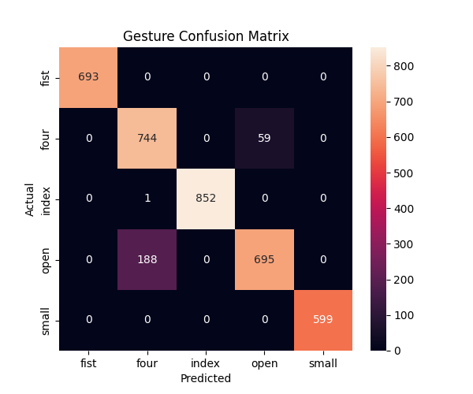

# 🖐️ Robust Hand Gesture Recognition under Real-World Conditions

## 🎥 Demo

<p align="center">
  
</p>

---

## 📌 Overview

A production-focused hand gesture recognition system designed to evaluate performance under real-world domain shifts such as lighting, background, and distance variations.

Unlike typical gesture projects, this system emphasizes **generalization, robustness, and failure analysis** rather than just high accuracy.

---

## 🎯 Problem Statement

Most gesture recognition systems perform well in controlled environments but fail under:

* Different lighting conditions
* Background variations
* Distance changes

This project evaluates how well a model performs under these real-world challenges.

---

## 🚀 Solution

* Extracted **21 hand landmarks** using MediaPipe
* Applied normalization for scale invariance
* Trained a **Random Forest classifier**
* Used **session-based split** to simulate real-world deployment
* Evaluated robustness across multiple conditions

---

## 🛠 Tech Stack

* Python
* OpenCV
* MediaPipe
* Scikit-learn
* NumPy, Pandas
* Matplotlib, Seaborn

---

## 📊 Results

### Overall Performance

* Accuracy: **~93–94%**

### Robustness Evaluation

| Condition              | Accuracy |
| ---------------------- | -------- |
| Controlled Environment | 1.00     |
| Moderate Variation     | 0.99     |
| Challenging Conditions | 0.88     |

### 📉 Confusion Matrix

<p align="center">
  
</p>

---

## ⚠️ Failure Analysis

* Confusion between **open** and **four** gestures due to similar finger patterns
* Performance drops in challenging conditions (~88%) due to:

  * Reduced landmark stability in low lighting
  * Lower resolution impact at far distances
* Model sensitive to **partial occlusions**

---

## 🧪 Evaluation Strategy

* Used **session-based split** instead of random split (prevents data leakage)
* Each session represents different real-world conditions
* Performed **condition-wise evaluation**
* Metrics used: Accuracy, Confusion Matrix

---

## 🧠 Key Learnings

* Generalization > raw accuracy
* Landmark normalization improves performance
* Distance and background affect prediction stability
* Real-world ML systems must be evaluated beyond standard train-test splits

---

## 💼 Why This Matters

This project simulates real-world ML deployment challenges where models must handle distribution shifts.

It demonstrates:

* Handling **domain shift**
* Avoiding **data leakage**
* Performing **failure analysis**

These are critical for production ML systems.

---

## 📂 Project Structure

```
robust-hand-gesture-recognition/
│
├── src/
│   ├── extract_landmarks.py
│   ├── preprocess.py
│   ├── train_model.py
│   ├── evaluate.py
│   ├── evaluate_conditions.py
│   ├── realtime_inference.py
│   └── test_hand_detection.py
│
├── results/
│   ├── demo.gif
│   └── confusion_matrix.png
│
├── requirements.txt
├── README.md
└── .gitignore
```

---

## ⚙️ How to Run

### 1. Clone repository

```bash
git clone https://github.com/sravani-engineer/robust-hand-gesture-recognition.git
cd robust-hand-gesture-recognition
```

### 2. Create virtual environment

```bash
python -m venv venv
venv\Scripts\activate
```

### 3. Install dependencies

```bash
pip install -r requirements.txt
```

### 4. Run real-time inference

```bash
python src/realtime_inference.py
```

---

## 🔄 Pipeline

Video Input → Landmark Extraction → Preprocessing → Model Training → Evaluation → Real-time Inference

